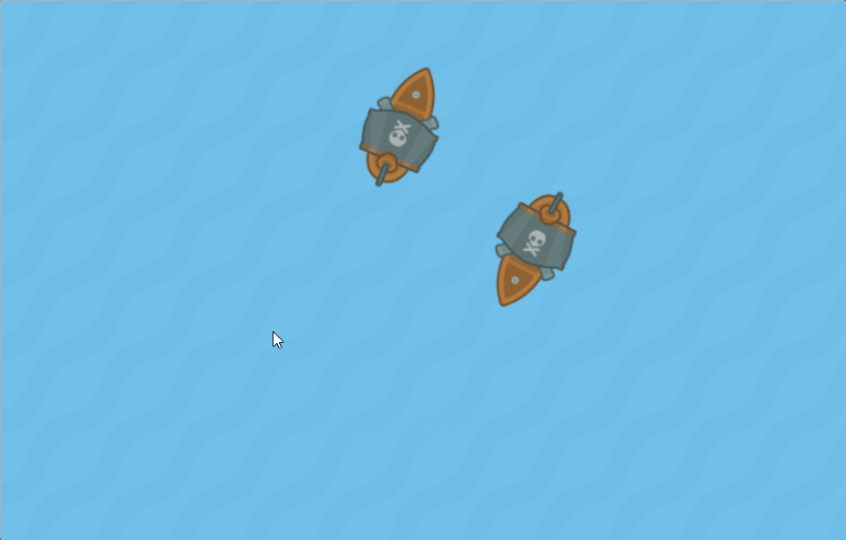

Tuts+ Multiplayer Pirate Game Tutorial
======================================

This project contains the complete example of my Tuts+ tutorial on creating a multiplayer game with Socket.io and Phaser. 

This is a local version of the online [Glitch app](https://glitch.com/edit/#!/tutsplus-pirate-shooter-starterkit). To run it:

* Download or clone the repository 
* Run `npm install` inside
* Run `npm start` 
* Open up http://localhost:5000 in your browser
* Open up another window and play!

Controls are W or UP to move towards mouse and click to shoot.